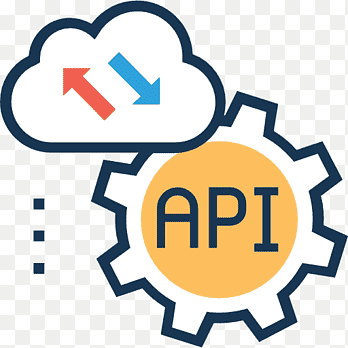

<h1 align="center">
    
</h1>

<h4 align="center">
  First API
</h4>

  <a href="#rocket-tecnologias">Technologies</a>&nbsp;&nbsp;&nbsp;|&nbsp;&nbsp;&nbsp;
  <a href="#-projeto">Project</a>&nbsp;&nbsp;&nbsp;|&nbsp;&nbsp;&nbsp;

 
 

## 🚀  Technologies

This project was developed using these following technologies:

- [Node](https://nodejs.org/en/docs/)
- [Javascript](https://developer.mozilla.org/en-US/docs/Web/JavaScript)
- [HTTP Requests](https://developer.mozilla.org/en-US/docs/Web/HTTP/Methods)

## 💻  Project

First API is a simple API to apply the first module concepts of JStack course.

This project have these main features:

- Define endpoints following REST pattern.
- URL parse to pull URL query params and convert these params in string-to-object.
- Use these query params when found a route.
- Split endpoint with slashes / to identify when the user make a request with id
- Save new ID that came from the routes.
- Compare array routes which route match the endpoint and HTTP method.
- Treat unknown routes.

---

Developed with ♥ by @ghiberti85
